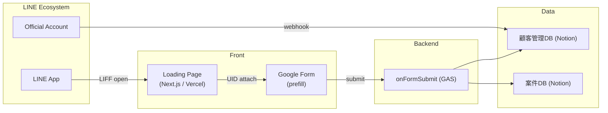

# 顧客管理 × LINE 連携システム — **MVP 仕様書 / 設計書**

## 1. 目的・スコープ

| 項目 | 内容 |
|------|------|
| **目的** | 写真館が LINE 公式アカウントを通じて取得した顧客情報を Notion CRM と連携し、問い合わせ対応・案件管理・セグメント配信を即座に行える仕組みを提供する |
| **対象機能（MVP）** | 1. 友だち追加 & LIFF ログインによる **LINE UID 取得**<br>2. Google フォームを用いた属性情報入力 (prefill)<br>3. GAS 経由で **Notion 顧客DB / 属性情報DB** 登録<br>4. 顧客 ↔ 案件のリレーション確認<br>5. セグメント抽出 ～ LINE 手動タグ配信 |
| **除外範囲** | 自動メッセージ配信、ダッシュボード、バックアップ自動化 |

---

## 2. システム構成図（論理）



---

## 3. データモデル概要

### 3.1 顧客DB
| プロパティ | 型 | 備考 |
|------------|----|------|
| 名前 (title) | Title | 世帯主 or 本人 |
| LINE UID | Rich text (unique) | 主キー。GASでデコード済みのUIDを保存・検索に利用 |
| LINEニックネーム | Rich text | LINEのニックネーム（友だち追加時に自動取得） |
| LINEプロフィール画像 | URL | LINEのプロフィール画像URL（友だち追加時に自動取得） |
| 電話番号 | Phone |  |
| メールアドレス | Email |  |
| 生年月日 | Date |  |
| LINE友達ブロック | Checkbox | false=友達、true=ブロック（GAS経由で新規作成時は常にfalse） |
| 家族メンバー | Relation (self) | 双方向・UI 片側表示 |
| 家族タグ | Select | 父 / 母 / 子_長女 … |
| ライフステージ | Formula | 長期判定式 |
| 撮影種別一覧 | Rollup | 案件DB→撮影種別 |
| 判定_七五三 ほか | Formula | `contains()` で抽出 |
| 備考 | Text |  |

### 3.2 属性情報DB
| プロパティ | 型 | 内容 |
|------------|----|------|
| 案件名★ | Title | 例 `20240701_山田太郎`（タイムスタンプ+名前） |
| 主顧客★ | Relation → 顧客DB | 顧客IDでリレーション |
| 撮影種別★ | Select | 七五三／成人式 etc |
| 予約日時候補1 | Date | Googleフォーム設問・Notion案件DB両方に追加（ISO8601形式、ゼロ埋め） |
| 予約日時候補2 | Date | Googleフォーム設問・Notion案件DB両方に追加（ISO8601形式、ゼロ埋め） |
| 予約日時候補3 | Date | Googleフォーム設問・Notion案件DB両方に追加（ISO8601形式、ゼロ埋め） |
| 撮影日★ | Date | |
| 撮影場所★ | Select | |
| ステータス★ | Status | 予約仮→納品完了 |
| 納品物 | Select |データ、アルバム、プリント |
| 納品方法 | Select |メール、LINE、配送、店頭受け取り |
| 納品期日 | Date | |
| 参考画像1 | URL | |
| 参考画像2 | URL | |
| 参考画像3 | URL | |
| 見積金額 | Number | ¥ |
| 備考 | Text | |

---

## 4. コンポーネント設計

### 4.1 Loading Page (Next.js)

| 項目 | 内容 |
|------|------|
| **構造** | `/pages/index.tsx` のみ（SSG） |
| **主要処理** | 1. 環境変数から `LIFF_ID`, `FORM_BASE`, `UID_KEY` を取得<br>2. `liff.init()` 実行後 `liff.getProfile()` で UID<br>3. `location.replace(FORM_BASE + "&" + UID_KEY + "=" + encodeURIComponent(uid))` |
| **スコープ** | `profile openid` |
| **UI** | 中央にスピナー＋テキスト「情報を取得中…」 |
| **環境変数設定** | Vercel の Environment Variables<br>`NEXT_PUBLIC_LIFF_ID` / `NEXT_PUBLIC_FORM_BASE` / `NEXT_PUBLIC_UID_KEY` |

### 4.2 Google Form

| 項目 | 内容 |
|------|------|
| **表示方式** | Next.js から **リダイレクト** |
| **prefill** | UID などパラメータを URL 末尾に連結 |
| **回答先** | スプレッドシート |

### 4.3 Google Apps Script

| ファイル | 関数 | 処理概要 |
|----------|------|----------|
| `Code.gs` | `onFormSubmit(e)` | 1. UID取得（base64デコードしformData.uidに格納）<br>2. 顧客DB検索/生成（searchCustomerByUid, createCustomer, updateCustomer）<br>3. 案件DB追加（createCase） |
| `notion.gs` | APIヘルパー | Notion API呼び出し（LINE_UIDはリッチテキスト型、デコード済みuidで保存・検索）<br>**LINEニックネーム・LINEプロフィール画像も保存** |
| `slack.gs` | `notifySlack` | エラー通知 |
| `webhook.gs` | `doPost(e)` | LINE友だち追加時にプロフィールAPIでニックネーム・画像を取得しNotionに保存 |

---

## 5. GAS連携仕様（要点）
- Googleフォームの設問「予約日時候補1〜3」を案件DBの該当プロパティ（日付型、ISO8601形式・ゼロ埋め）に登録
- 案件名は「タイムスタンプ（YYYYMMDD）」＋「名前」
- 主顧客リレーションは顧客IDで紐付け
- 顧客新規作成時は「LINE友達ブロック: false」固定
- Notionのプロパティ内部名は日本語名
- LINE_UIDはGASでデコード済みの値をリッチテキスト型で保存・検索

---

## 6. セキュリティ

- 全通信 HTTPS  
- UID は base64でエンコードしたものとURL パラメータに付与し、バックエンドでデコードして顧客DBへ保存（formData.uid）、将来 JWT化検討  
- 友達追加時メッセージ & Googleフォームで利用目的通知
- スクリプトプロパティでAPIキーやDB ID等を一元管理
- Webhookは署名検証（X-Line-Signature）を必ず実装
- Slack通知で障害検知を迅速化
- 必要に応じてログ出力も追加

---

## 7. 拡張性

- 顧客DB・案件DBのプロパティ追加もスクリプトプロパティや定数で管理
- 他の通知先（メール等）もslack.gsに追加可能

---

### Appendix：長期ライフステージ Formula

<details>
<summary>ライフステージ Formula（全文）</summary>

```
// 年齢 は別 Formula
if(prop("年齢") < 1, "新生児 (0‑1歳)",
if(prop("年齢") < 3, "乳児 (1‑2歳)",
if(prop("年齢") < 6,
  if(or(prop("年齢") == 3, prop("年齢") == 5), "七五三候補 ("+format(prop("年齢"))+"歳)", "未就学児 (3‑5歳)"),
if(prop("年齢") < 12,
  if(prop("年齢") == 7, "七五三本番 (7歳)", "小学生 (6‑11歳)"),
if(prop("年齢") == 12, "小学校卒業候補 (12歳)",
if(prop("年齢") < 15, "中学生 (13‑14歳)",
if(prop("年齢") == 15, "中学卒業候補 (15歳)",
if(prop("年齢") < 18, "高校生 (16‑17歳)",
if(or(prop("年齢") == 17, prop("年齢") == 18), "成人式前撮り候補 ("+format(prop("年齢"))+"歳)",
if(prop("年齢") == 19, "成人式本番年 (19歳)",
if(prop("年齢") == 20, "成人式後撮り (20歳)",
if(prop("年齢") >= 60 and prop("年齢") < 70,
  if(prop("年齢") == 60, "還暦 (60歳)", "シニア (60‑69歳)"),
if(prop("年齢") == 70, "古希 (70歳)",
if(prop("年齢") == 77, "喜寿 (77歳)",
if(prop("年齢") == 80, "傘寿 (80歳)",
if(prop("年齢") == 88, "米寿 (88歳)",
if(prop("年齢") == 90, "卒寿 (90歳)",
if(prop("年齢") == 99, "白寿 (99歳)",
if(prop("年齢") >= 100, "百寿 (100歳以上)", "成人 (21‑59歳)")))))))))))))))))))
```
</details>


https://line-notion-crm-photo-studio-demo.vercel.app/